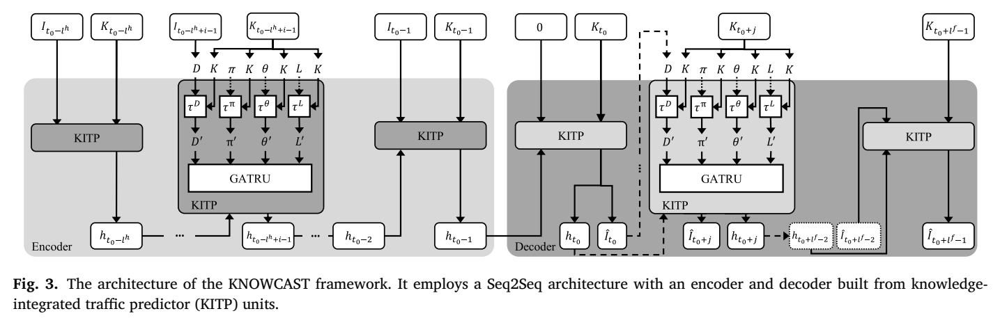
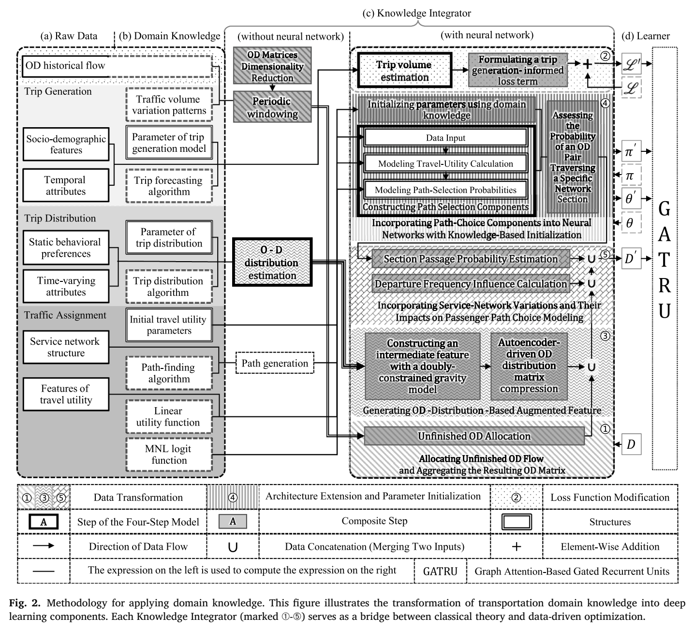
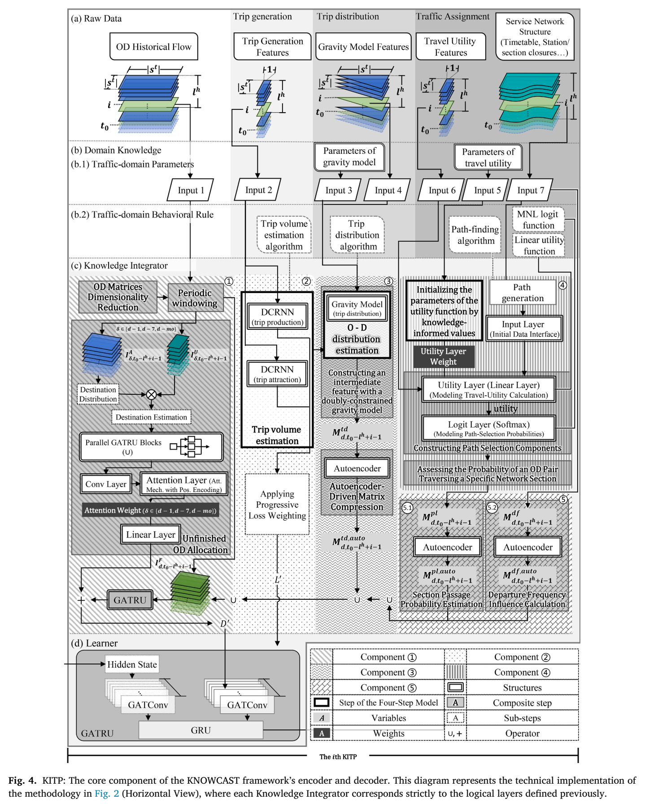

<p align="center">
  
</p>

<h1 align="center">KNOWCAST</h1>

<p align="center"><strong>Domain-knowledge-integrated deep learning for metro OD forecasting and path flow estimation</strong></p>
<p align="center"><strong>Hao Zheng¹ · Han Zheng²* · George Giannopoulos³</strong><br>
¹ Tsinghua University &nbsp; ² Beijing Jiaotong University &nbsp; ³ Aristotle University of Thessaloniki (emeritus)</p>
<p align="center"><strong>Transportation Research Part C: Emerging Technologies · Volume 189 · 2026 · Article 105710</strong></p>
<p align="center"><a href="https://doi.org/10.1016/j.trc.2026.105710"></a>
<a href="https://github.com/scholarhaozheng/KNOWCAST"></a></p>
<p align="center"><strong>Website:</strong> <a href="https://scholarhaozheng.github.io/KNOWCAST/">KNOWCAST on GitHub Pages</a></p>
<p align="center"><strong>Transportation theory inside the learning process.</strong><br>
Forecast metro demand and infer how it moves through the network in one coupled framework.</p>

[Overview](#overview) · [Architecture](#architecture) · [Results](#main-results) · [Ablations](#ablation-studies) · [Path-flow evidence](#path-flow-and-section-load-evidence) · [Citation](#citation) · [Original code guide](#original-implementation-guide)

---

<p align="center">
  
</p>
<p align="center"><em>Figure 3 from the paper. Knowledge-integrated traffic predictor units connect historical demand, transportation knowledge, and future OD forecasts.</em></p>

> **At a glance:** 154 stations · 17 transfer stations · 15-minute intervals · 10 forecasting baselines.<br>
> KNOWCAST achieves **1.02 MAE**, **3.04 RMSE**, and **54.25% WMAPE** on the reported test task.

## Overview

KNOWCAST (**Knowledge-Integrated OD Forecasting and Path-Flow Estimation**) combines transportation knowledge with a sequence-to-sequence deep learning model. It jointly forecasts short-term metro origin–destination (OD) demand and infers path flows through an embedded, differentiable assignment mechanism.

The central challenge is partial observability: Automated Fare Collection (AFC) records identify entry and exit stations and times, but do not reveal the route taken inside a metro network. Meanwhile, service changes, demographic context, and time-varying demand influence both the amount of travel and its distribution.

KNOWCAST addresses these challenges by incorporating **trip generation, trip distribution, and traffic assignment** into the model’s features, loss, architecture, and parameter initialization. Its inferred path flows remain structurally coupled to its OD forecasts.

### What the paper contributes

- **Structured knowledge integration.** Transportation mechanisms translate influencing factors into model components rather than leaving all relationships to be learned from concatenated inputs.
- **Coupled OD and path-flow outputs.** A trainable utility layer and Logit assignment connect OD forecasts to topology-feasible candidate paths without requiring path-level training labels.
- **Interpretable adaptation.** Knowledge-derived utility parameters provide initial values and are refined during training; their trajectories can be inspected.
- **Empirical evaluation.** The study compares ten baselines, tests individual and combined components, examines a second learner architecture, and assesses section-load plausibility using sampled observations.

### Reading map

| Paper section | Focus |
| --- | --- |
| **1 · Introduction** | AFC observability, influencing-factor integration, behavioral mechanisms, and joint OD/path modeling |
| **2 · Literature review** | Classical transportation, statistical, machine learning, and spatiotemporal deep learning methods; knowledge integration and assignment gaps |
| **3 · Framework** | Four integration mechanisms and the knowledge-integrated encoder–decoder |
| **4 · KITP** | Five Knowledge Integrators, unfinished-trip allocation, progressive loss, gravity features, Logit assignment, service representations, path/section inference, and GATRU |
| **5 · Experiments** | Data and tuning, baseline comparisons, ablations, computational cost, indirect operational assessment, and task-setting sensitivity |
| **6 · Conclusion** | Findings, interpretation boundaries, transfer potential, and future work |

The [published paper](https://doi.org/10.1016/j.trc.2026.105710) contains the full derivations and reference list.

## Architecture

### Four ways to integrate transportation knowledge

<p align="center">
  
</p>
<p align="center"><em>Figure 2 from the paper. Knowledge integration modifies the data, loss, architecture, and parameter initialization.</em></p>

| Integration mechanism | How KNOWCAST uses it |
| --- | --- |
| **Data transformation** | Constructs transportation-informed features from distribution, route choice, and service conditions |
| **Loss modification** | Adds a station-level trip-generation consistency term with a decaying weight |
| **Architecture extension** | Embeds behavioral and network mechanisms, including a differentiable Logit assignment component |
| **Parameter initialization** | Initializes selected trainable utility coefficients from transportation knowledge |

### Five Knowledge Integrators inside KITP

The **Knowledge-Integrated Traffic Predictor (KITP)** is the building block used throughout the encoder and decoder.

| Component | Role | Implementation |
| --- | --- | --- |
| **1 · Unfinished OD allocation** | Reconstructs a more complete historical demand representation | Origin-specific selective aggregation; previous-day, previous-week, and previous-month destination patterns; parallel GATRUs and attention gating |
| **2 · Trip generation** | Provides station-level structural guidance during early training | A pre-trained DCRNN estimates production and attraction from station catchment and temporal features; a consistency loss guides the main model |
| **3 · Trip distribution** | Encodes shifts in inter-station demand | A doubly constrained gravity model, iterative proportional fitting, and an autoencoder produce distribution features |
| **4 · Path choice** | Connects transportation behavior to differentiable assignment | Path attributes → trainable linear utilities → Multinomial Logit probabilities |
| **5 · Service network** | Encodes the effects of operational conditions | Section-use probabilities and line-specific departure-frequency matrices are compressed into task-specific representations |

<p align="center">
  
</p>
<p align="center"><em>Figure 4 from the paper. The KITP connects knowledge-derived features and objectives to a graph-attention recurrent learner.</em></p>

### Encoder, decoder, and learner

The encoder consumes realized historical data over a lookback window of length $l_h$. The decoder predicts the next $l_f$ intervals, starting from the final encoder state and a zero OD input. Subsequent decoder steps use the preceding ground-truth OD matrix during training and the preceding prediction during inference.

The decoder omits the three unfinished-trip GATRUs because future unfinished-trip observations are unavailable at the prediction origin. Future exogenous inputs must be known, announced, or forecastable at that time; these can include planned headways, service notices, weather forecasts, and public event schedules.

The **Graph Attention Gated Recurrent Unit (GATRU)** combines:

1. **Graph attention**, which learns how neighboring stations contribute within the physical network’s feasible attention neighborhoods.
2. **Gated recurrent updates**, which capture temporal evolution using those spatial features and the preceding hidden state.

Distribution, path-choice, and service-frequency autoencoders are first pre-trained for reconstruction, then their encoders are fine-tuned with the forecasting model.

## Key mechanisms and equations

The notation below condenses the paper’s equations. Let $m$ and $n$ denote origin and destination stations, $p$ a candidate path, and $\omega$ a directed network section.

### Observe finished trips; allocate unfinished trips

For each origin, actual departures equal finished departures plus unfinished entries:

```math
\sum_n I^{A}_{mn}=\sum_n I^{F}_{mn}+I^{U}_m.
```

Historical destination shares from the previous day, week, and month allocate current unfinished counts. A uniform distribution is used if a reference row has zero total flow. Separate recurrent representations are fused with attention-based gates.

### Compress destination dimensions while preserving origin totals

For each origin, the model retains the highest-volume destinations identified **only from the training period** and aggregates all remaining destinations into one residual column. The mapping remains fixed during training, validation, and testing.

```math
I^{X}_{m,\mathrm{residual}}
=
\sum_{n\notin\mathrm{RDS}_m} I^{\mathrm{raw},X}_{mn},
\qquad X\in\{A,F\}.
```

The reported **0.23 retention ratio is a matrix-dimension retention ratio**. It is not a statement that only 23% of passenger volume is retained: the residual column preserves the remaining origin-level flow.

### Guide early training with trip generation

The generation loss penalizes disagreement between estimated station production/attraction and the corresponding totals implied by the OD prediction. Destination totals use a fixed training-period allocation of residual flows.

```math
\mathcal L_{\mathrm{total}}^{(\varepsilon)}
=
\mathcal L_{\mathrm{OD}}
+
w_g(\varepsilon)\mathcal L_g,
\qquad
w_g(\varepsilon)=w_g(0)\max(1-\alpha_{\mathrm{decay}}\varepsilon,0).
```

The main OD objective is MAE in the original flow-value scale. With the selected $\alpha_{\mathrm{decay}}=0.1$, the auxiliary weight decays to zero over the first ten epochs.

### Estimate distribution with a gravity model

```math
\gamma^{\mathrm{TD}}_{mn}
=
B^O_mP_mB^D_nA_n\exp(-\zeta c_{mn}).
```

Production $P$, attraction $A$, and generalized impedance $c$ vary with conditions. The deterrence coefficient $\zeta$ is pre-calibrated offline and held fixed during main-model training; balancing coefficients are updated through iterative proportional fitting.

### Infer paths and sections from OD forecasts

```math
U_{p}=\sum_{\phi}\beta_{\phi}\psi_{\phi}(p),
\qquad
\Pr(p\mid m,n)=
\frac{\exp(U_p)}
{\sum_{q\in\mathcal P_{mn}}\exp(U_q)}.
```

```math
\widehat{\mathrm{PathFlow}}_{mn,p}
=
\widehat I_{mn}\Pr(p\mid m,n),
```

```math
\widehat{\mathrm{LinkFlow}}_{\omega}
=
\sum_{(m,n)\in\mathcal R}
\widehat I_{mn}
\sum_{p\in\mathcal P_{mn}}
\Pr(p\mid m,n)\,u(p,\omega).
```

Here, $\mathcal R$ is the set of **explicitly retained real OD pairs**, and $u(p,\omega)$ indicates whether a path traverses a section. The residual destination column is excluded from path and section assignment because it has no single destination or unique candidate-path set.

The Softmax normalization has no trainable parameters. The utility coefficients are trainable, and path probabilities sum to one for each OD pair.

## Data and experimental setup

### City S Metro

| Item | Reported setting |
| --- | --- |
| Network | An anonymized major metropolitan metro system in Eastern China |
| Coverage | Lines 1, 2, 3, 4, the branch of Line 4, and Line 5 |
| Stations / interchanges | **154 stations / 17 transfer stations** |
| Raw OD matrix | **154 × 154 = 23,716 entries**, including diagonal entries |
| Time resolution | **15 minutes** |
| Training | **March 1–31, 2023** |
| Temporal gap | **April excluded** between training and evaluation |
| Validation | **May 1–10, 2023** |
| Test | **May 11–20, 2023** |
| Main comparison target | Fixed **0.23 OD matrix-dimension retention ratio** for every model |
| Training scale | More than **16 million effective spatiotemporal data points** after selective aggregation |

Operational variation includes weekday/weekend transitions, headway changes, and holiday demand. Timetables and service notices supply operational inputs. Population raster data and district-level census information are fused within **800 m station catchments** to estimate population, working-age shares, educational profiles, and household size. Temporal and event features provide additional station context.

### Training and selected hyperparameters

Hyperparameters were selected with **Optuna**, using a **TPE sampler**, **MedianPruner**, and **SQLite storage**. The study ran **80 trials**, with **at most 40 epochs per trial**, minimizing validation MAE; the best configuration occurred at **Trial 78** and was followed by a full training run. Baselines were also tuned using Bayesian optimization.

| Hyperparameter | Selected value |
| --- | ---: |
| Base learning rate | 0.00653 |
| Dropout probability | 0.442 |
| Recurrent hidden units | 96 |
| GAT feature dimension | 256 |
| Initial trip-generation loss weight | 0.0264 |
| Loss decay rate | 0.1 |
| Additional distribution dimension | 5 |
| Additional section feature dimension | 6 |
| Initial per-station utility coefficient | −0.30 |
| Initial transfer utility coefficient | −0.573 |

<details>
<summary><strong>Hyperparameter search space from Table 2</strong></summary>

| Hyperparameter | Search space |
| --- | --- |
| Loss decay rate | {0.01, 0.05, 0.1, 0.2, 0.5} |
| Learning rate | [10⁻⁵, 10⁻²], log-uniform |
| Dropout | [0.0, 0.5], uniform |
| Recurrent hidden units | {64, 96, 128, 192} |
| GAT feature dimension | {256, 512, 768} |
| Trip-generation loss weight | [10⁻⁵, 10⁻¹], log-uniform |
| Distribution dimension | {2, 3, 4, 5} |
| Section feature dimension | {5, 6, 7, 8} |

</details>

Metrics are calculated separately for each prediction horizon and then averaged. MAE and RMSE are in passenger-flow units; WMAPE is the total absolute error divided by the total observed flow. SMAPE is used for the segmented demand analysis. Test curves shown in the paper are post-hoc diagnostics and were not used for tuning or model selection.

## Main results

**Table 3 · OD prediction performance. Lower is better.**

| Model | MAE ↓ | RMSE ↓ | WMAPE ↓ |
| --- | ---: | ---: | ---: |
| LSTM | 1.41 | 6.48 | 76.36% |
| DCRNN | 1.49 | 8.12 | 80.69% |
| GConvGRU | 1.48 | 7.65 | 80.15% |
| GConvLSTM | 1.36 | 5.61 | 73.65% |
| GCLSTM | 1.38 | 5.95 | 74.73% |
| LRGCN | 1.38 | 5.79 | 74.73% |
| TGCN | 1.38 | 6.04 | 74.73% |
| A3T-GCN | 1.46 | 6.61 | 79.06% |
| AGCRN | 1.36 | 5.61 | 73.65% |
| STConv | 1.50 | 6.95 | 81.23% |
| **KNOWCAST** | **1.02** | **3.04** | **54.25%** |

Relative to the strongest reported baseline values, KNOWCAST reduces **MAE by 25.0%**, **RMSE by 45.8%**, and **WMAPE by 26.3%**. The WMAPE change is **19.40 percentage points**. These reductions are calculated from the rounded values in Table 3.

The paper’s time-series examples show that the model follows major demand patterns while smoothing some abrupt, short-lived peaks. The reported validation/test RMSE difference is linked to the magnitude of extreme errors; it does not establish that the test period is generally easier.

### Performance across the demand distribution

| OD group | Share of passenger flow | Share of OD pairs | WMAPE | SMAPE |
| --- | ---: | ---: | ---: | ---: |
| High-volume · Head | 30% | 6.2% | 47.0% | 67.0% |
| Mid-volume · Body | 50% | 37.5% | 70.4% | 111.1% |
| Low-volume · Tail | 20% | 56.3% | 95.4% | 142.5% |

Sparse flows amplify percentage errors. Across **4,361,831 zero-flow instances** in the Tail group, the average prediction is **0.10 passengers**, with a maximum absolute prediction of **8.52**. Corresponding average predictions are **0.74** for Body and **1.75** for Head zero-flow instances.

## Ablation studies

All cases below retain Component 1 for unfinished-trip processing and selective aggregation. **C2** denotes trip generation, **C3** distribution, **C4** utility/path choice, **C5.1** section probabilities, and **C5.2** departure frequency.

**Tables 4–5 · Component configurations and final forecasting performance.**

| Case | Learner and configuration | MAE ↓ | RMSE ↓ | WMAPE ↓ |
| --- | --- | ---: | ---: | ---: |
| **2** | **GATRU · Full KNOWCAST** | **1.02** | **3.04** | **54.25%** |
| 2b | GATRU · Full model without C2 | 1.02 | 3.06 | 54.27% |
| 2c | GATRU · C2 with temporal features only | 1.02 | 3.08 | 54.42% |
| 3 | GATRU · Component 1 only | 1.24 | 5.19 | 67.15% |
| 3b | GATRU · Exogenous inputs through a generic MLP | 1.21 | 4.85 | 65.53% |
| 4 | GATRU · + C2 | 1.22 | 5.12 | 66.07% |
| 5 | GATRU · + C3 | 1.14 | 3.64 | 61.74% |
| 6 | GATRU · + C5.2 | 1.21 | 4.20 | 65.53% |
| 7 | GATRU · + C4 with fixed utilities + C5.1 | 1.19 | 3.92 | 64.44% |
| 8 | GATRU · + C4 with trainable utilities + C5.1 | 1.10 | 3.45 | 59.57% |
| 9 | GConvLSTM · Component 1 only | 1.35 | 5.58 | 73.10% |
| 10 | GConvLSTM · + C2 | 1.35 | 5.57 | 72.64% |
| 11 | GConvLSTM · + C3 | 1.24 | 4.41 | 67.15% |
| 12 | GConvLSTM · + C5.2 | 1.32 | 5.32 | 73.01% |
| 13 | GConvLSTM · + C4 with fixed utilities + C5.1 | 1.31 | 4.66 | 70.94% |

The results distinguish several effects: distribution and trainable route-choice features improve final prediction metrics; service-frequency features help reduce large errors; and knowledge integration also benefits the alternative GConvLSTM learner.

### Trip generation principally improves the early training trajectory

**Table 6 · Comparison at epoch 30.**

| Configuration | MAE ↓ | RMSE ↓ | WMAPE ↓ |
| --- | ---: | ---: | ---: |
| Full features · Case 2 | **1.138** | **4.401** | **58.11%** |
| No trip generation · Case 2b | 1.277 | 5.729 | 65.20% |
| Temporal features only · Case 2c | 1.221 | 5.927 | 62.39% |

Final MAE reaches 1.02 in all three cases. The main benefit of trip generation and socio-demographic context is therefore **stronger early guidance and more efficient convergence**, with limited effect on the final asymptotic accuracy.

### Learned utility parameters

In Case 8, the utility coefficients evolve from **−0.30 to approximately −1.25** for station traversal and from **−0.573 to approximately −0.77** for transfers. Breakpoint analysis identifies transitions near epochs **55** and **68**, respectively.

These are **forecasting-calibrated operational coefficients for the studied network**. They are not directly measured population preferences or universally transferable behavioral constants.

## Computational efficiency

**Table 7 · Measurements on the reported CPU workstation.**

| Model | Training time / epoch | Inference latency / batch |
| --- | ---: | ---: |
| GConvLSTM · Case 9 | 22.5 s | 1,250 ms |
| Base GATRU · Case 3 | 24.9 s | 1,351 ms |
| GATRU + generic MLP · Case 3b | 28.7 s | 1,485 ms |
| KNOWCAST · Case 2 | 43.8 s | 2,150 ms |

The workstation used two Intel Xeon Gold 5318Y CPUs at 2.10 GHz, **48 physical cores**, **96 logical threads**, and **503 GiB memory**. Latency is a single validation forward pass per batch, averaged over five consecutive epochs; it is not a per-passenger or per-OD latency.

## Path-flow and section-load evidence

The model estimates path flows from predicted retained-OD demand and learned choice probabilities. Those estimates are aggregated to directed sections. Figure 14 in the paper shows average section density and the 33 largest cumulative directed section-flow entries.

**Path-level ground-truth labels are unavailable.** The empirical assessment therefore compares aligned train-load estimates with sampled observations, rather than validating individual paths or continuous section flows directly.

The observation protocol covers **14 fixed daily time slices over 10 days**. Annotators count passengers in one designated carriage of a selected train; a corridor- and period-calibrated factor expands those counts to train-level observations. The modeled flows undergo:

1. **Scale compensation** for destinations represented only by the residual OD column.
2. **Gaussian temporal dispersion** to account for downstream travel delay and spread.
3. **Dynamic headway conversion** from section volumes to train loads.

**Table 8 · Three-level error tracing on representative congested sections.**

| Section | Line | Micro OD WMAPE | Spatial aggregate WMAPE | Final load WMAPE | Pearson $r$ |
| --- | --- | ---: | ---: | ---: | ---: |
| JL → M | 1 | 46.87% | 11.80% | 22.76% | 0.863 |
| SRS → SJ | 2 | 57.57% | 19.13% | 23.27% | 0.780 |
| SW → S | 3 | 57.49% | 19.33% | 21.23% | 0.926 |
| H → Q | 4 | 73.13% | 37.68% | 25.75% | 0.916 |
| N → X | 5 | 73.15% | 34.40% | 28.19% | 0.865 |

Final load WMAPE ranges from **21.23% to 28.19%**, with correlations of **0.780–0.926**. These results support **indirect operational plausibility** after alignment. Carriage expansion and residual inter-carriage imbalance remain sources of uncertainty.

## Forecasting-task sensitivity

| Task setting | MAE ↓ | RMSE ↓ | WMAPE ↓ |
| --- | ---: | ---: | ---: |
| Short context: $l_h=2,\ l_f=4$ | 1.30 | 4.70 | 61.89% |
| Longer horizon: $l_h=4,\ l_f=12$ | 1.60 | 8.00 | 74.55% |
| 15% matrix-dimension retention | 0.86 | 2.65 | 43.67% |
| 80% matrix-dimension retention | 1.72 | 9.41 | 77.94% |

Shorter historical context and longer forecast horizons make prediction harder. Retention settings require a different interpretation: stronger compression changes the prediction target by aggregating more sparse destinations. Its lower errors should not be interpreted as improved accuracy on an unchanged full OD matrix.

## Scope and future work

- **One-city validation.** Cross-city transfer and evolving-network generalization remain potential applications requiring further evaluation.
- **Unobserved routes.** Path estimates are structurally constrained inferences, and direct path-level accuracy is not established.
- **Residual demand.** Path and section inference covers explicitly retained OD pairs; the aggregate residual is excluded from direct assignment.
- **Long-tail errors.** Percentage errors remain high on sparse OD pairs, even when absolute predictions on zero-flow cases are small.
- **Complex interactions.** Further work should quantify sensitivity to knowledge-based initialization and nonlinear interactions among Knowledge Integrators.
- **Disruption scenarios.** Emergency evacuations and more complex operational disruptions are proposed directions for future study.

## Website and repository contents

This repository contains the original model implementation, the research website, and the paper documentation. The original code workflow and file-level guide remain below.

~~~text
README.md
dmn_knw_gnrtr/ · lib/ · metro_components/ · metro_data_convertor/ · models/
train_save_history.py · bayes_opt.py · evaluate_button.py
docs/
    ├── index.html
    ├── styles.css
    ├── app.js
    └── assets/
        └── figure-*.png
~~~

### Preview the website

From this directory, run:

~~~bash
python -m http.server 4173 --directory docs
~~~

Then open [the local preview](http://localhost:4173). You can also open **docs/index.html** directly in a browser.

**中文维护说明：** 网页内容、样式和交互分别位于 docs/index.html、styles.css 和 app.js。论文图件位于 docs/assets/，后续可以补充或替换；README 中的图件使用相对路径。本仓库同时包含模型源码；模型运行与训练请参考下方保留的原始使用说明。

## Data availability and authorship

The article states: **“Data will be made available on request.”** City S is anonymized under the data provider’s confidentiality agreement.

**Corresponding author:** Han Zheng · [han_zheng@bjtu.edu.cn](mailto:han_zheng@bjtu.edu.cn)

| Author | Contributions reported in the paper |
| --- | --- |
| Hao Zheng | Conceptualization, data curation, formal analysis, investigation, methodology, software, validation, visualization, and original draft |
| Han Zheng | Conceptualization, data curation, formal analysis, investigation, methodology, project administration, resources, supervision, validation, and review/editing |
| George Giannopoulos | Conceptualization, data curation, formal analysis, investigation, methodology, supervision, and review/editing |

The authors declare no competing interests. This work was supported by the **Talent Fund of Beijing Jiaotong University**, Grant **2024XKRC055**.

## Citation

If you use or discuss KNOWCAST, please cite:

~~~bibtex
@article{zheng2026knowcast,
  title   = {{KNOWCAST}: Domain-knowledge-integrated deep learning for metro {OD} forecasting and path flow estimation},
  author  = {Zheng, Hao and Zheng, Han and Giannopoulos, George},
  journal = {Transportation Research Part C: Emerging Technologies},
  volume  = {189},
  pages   = {105710},
  year    = {2026},
  doi     = {10.1016/j.trc.2026.105710},
  url     = {https://doi.org/10.1016/j.trc.2026.105710}
}
~~~

<p align="center">
  <a href="https://doi.org/10.1016/j.trc.2026.105710">Read the paper</a>
  &nbsp; · &nbsp;
  <a href="https://github.com/scholarhaozheng/KNOWCAST">Explore the research code</a>
</p>


完整论文阅读器：[paper.html](docs/paper.html)，含原始37页PDF和逐页文本。


---

## Original implementation guide

The original repository instructions remain here: code layout, dataset preparation, training, evaluation, file-specific notes, and the HIAM acknowledgement. Example local data files and configs described in this guide are not included in the repository.

**Original title:** KNOWCAST: A Knowledge-augmented Framework for Urban Rail OD Prediction


KNOWCAST is a deep learning framework for predicting time-series Origin-Destination (OD) matrices in urban rail systems. It leverages a novel graph-based neural network architecture that integrates multiple types of domain knowledge from transportation science to enhance prediction accuracy. The framework is designed to model the complex spatio-temporal dependencies of passenger flow by incorporating principles from the classic four-step travel demand model: Trip Generation, Trip Distribution, and Traffic Assignment.

This repository contains the full source code for data preprocessing, model training, hyperparameter optimization, and evaluation.

-----

## Repository Structure

The repository is organized into several key directories:

  * **`/dmn_knw_gnrtr`**: (Domain Knowledge Generator) Contains all scripts for data preprocessing. This includes connecting to databases, calculating metro travel paths, generating OD matrices, and training auxiliary models for domain knowledge integration.
  * **`/lib`**: Contains core utility functions, including custom data loaders (`utils_CUROP.py`) and performance metrics (`metrics.py`).
  * **`/models`**: The core of the project, containing all PyTorch model definitions.
      * `Net_0207.py`: The main predictive model that fuses historical data with domain knowledge.
      * `OD_Net_att.py`: The underlying encoder-decoder architecture with attention.
      * `GATRUCell.py` / `GGRUCell.py`: Custom graph recurrent units used in the encoder-decoder.
  * **`/metro_components`**: Defines classes for the metro system (e.g., Station, Line, Path) and a data requester for Suzhou's metro system.
  * **`/metro_data_convertor`**: Scripts for converting and processing various forms of metro data.
  * **`/data`**: (Not included in repo, but required for execution) This directory should contain all raw data, configuration files, and processed outputs.
  * **Root Directory**: Contains main scripts for orchestration, training, and evaluation.

-----

## Workflow and Usage

The project follows a sequential workflow from data generation to model evaluation.

**1. Setup and Configuration**

  * **Database Connection**: Configure your MySQL database credentials and table names in `dmn_knw_gnrtr/processing_sql.py` and `dmn_knw_gnrtr/generating_array_OD.py`.
  * **Data Files**: Place your metro network data (e.g., `Suzhou_zhandian_no_11.xlsx`) and operational data in a directory (e.g., `/data/suzhou_03_trimmed`).
  * **Main Configuration**: The primary configuration for training is handled by a YAML file (e.g., `data/config/train_sz_dim26_units96_h4c512_250503.yaml`). Update the paths and hyperparameters in this file as needed. The path to this file is set in `config.py`.

**2. Domain Knowledge Generation**
The entire data preprocessing pipeline is orchestrated by `generating_domain_knowledge_no_DO_clean.py`. This script performs a series of steps to prepare the data and domain knowledge features required for the main model. To run the full pipeline, execute:

```bash
python generating_domain_knowledge_no_DO_clean.py
```

This script will:

  * Connect to the SQL database to fetch raw trip data and generate time-stamped OD matrices (`generating_array_OD.py`).
  * Train auxiliary models for Trip Generation and Trip Distribution (`run_PYGT_0917.py`, `fit_trip_generation_model.py`).
  * Process the data into sequence-to-sequence format (`.pkl` files) suitable for the main model.
  * Generate and save other domain knowledge features.

**3. Hyperparameter Optimization (Optional)**
You can perform Bayesian hyperparameter optimization using Optuna.

```bash
python bayes_opt.py
```

This script will run multiple training trials with different hyperparameters, find the best combination based on validation MAE, and save the results.

**4. Model Training**
To train the main `Net_0207` model, run the `train_save_history.py` script.

```bash
python train_save_history.py
```

This script will:

  * Load the configuration from the YAML file specified in `config.py`.
  * Load the preprocessed datasets generated in Step 2.
  * Initialize the `Net_0207` model and execute the training loop.
  * Log all metrics and generate plots for analysis.

**5. Evaluation**
To evaluate a trained model on the test set, use the `evaluate_button.py` script. Update the evaluation configuration file (e.g., `data/config/eval_sz_dim... .yaml`) to point to your saved model path (`save_path`). Run the script:

```bash
python evaluate_button.py
```

This will load the model, run it on the test dataset, calculate the final performance metrics, and save the raw predictions (`test_pred.npy`) and ground truth (`test_true.npy`).

-----

## File-Specific Documentation

### `dmn_knw_gnrtr/fit_trip_generation_model.py`

  * **Purpose**: Implements and fits a doubly constrained gravity model for trip distribution. It optimizes parameters to predict OD flow ($q_{v}$) based on total departures ($O$), total arrivals ($D$), and impedance ($C$).
  * **Key Functions**:
      * `impedance_function(C, gamma)`: Calculates the impedance function $f(C)=(C+\epsilon)^{-\gamma}$.
      * `compute_flow(O, D, C, gamma, a, b)`: Computes the predicted OD flow matrix using the gravity model formula.
      * `objective_function(...)`: Calculates the Mean Squared Error (MSE) between predicted and observed flows.
      * `fit_trip_generation_model(...)`: The main function that uses the Adam optimizer to find the optimal parameters ($\gamma, a, b$).
  * **Usage**: Called by the main data generation pipeline, taking tensors for departures, arrivals, observed flows, and an impedance matrix as input.
  * **Outputs**: The optimized parameters and a list of predicted flow matrices.

### `dmn_knw_gnrtr/generating_array_OD.py`

  * **Purpose**: Extracts trip data from a MySQL database and transforms it into structured NumPy arrays (`(X, y)` sequences) for sequence-to-sequence modeling.
  * **Key Functions**:
      * `Connect_to_SQL(...)`: Connects to MySQL, executes a query, and loads data into a Pandas DataFrame.
      * `generate_OD_DO_array(...)`: Aggregates raw trip records into time-stamped OD matrices using multithreading.
      * `generating_trip_generation_data_and_OD_dict(...)`: Transforms the time-series of OD matrices into overlapping input/target sequences and generates corresponding historical context sequences (previous day/week).
  * **Usage**: Called by the main pipeline for each dataset split (train, test, val).
  * **Outputs**: Multiple `.pkl` files containing the time-stamped OD matrices, the final input/target sequences, and historical context data.

### `dmn_knw_gnrtr/Generating_Metro_Related_data.py`

  * **Purpose**: Generates path-related domain knowledge by finding the top-K shortest paths for every OD pair using graph traversal algorithms. This information is used for traffic assignment modeling.
  * **Key Functions**:
      * `dijkstra(...)`: Standard Dijkstra's algorithm for the single shortest path.
      * `yen_ksp(...)`: Yen's K-shortest path algorithm to find k distinct shortest paths.
      * `Generating_Metro_Related_data(...)`: The main function that loads the metro network, builds the graph, and iterates through all OD pairs to find and save their paths.
  * **Usage**: Run once for a static metro network. It's called by the main data pipeline.
  * **Outputs**: A `train_dict.pkl` file containing dictionaries that map OD pairs to paths (`OD_path_dic`), metro sections to paths (`section_path_dic`), and paths to sections (`path_section_dic`).

### `dmn_knw_gnrtr/generating_OD_path_array.py`

  * **Purpose**: Creates time-varying feature arrays for each OD pair, describing the characteristics (e.g., number of stations, transfers) of the top-3 available paths at each timestamp based on the network's operational status.
  * **Key Functions**:
      * `processing_Time_DepartFreDic_item(...)`: For a single timestamp, builds an adjacency matrix of operational sections and extracts path features for each OD pair. Designed for parallel execution.
      * `batch_processing(...)`: Manages the parallel processing across multiple CPU cores.
  * **Usage**: Executed by the main data generation pipeline.
  * **Outputs**: `OD_feature_array_dic.pkl`, a dictionary mapping timestamps to NumPy arrays of shape `(num_stations, num_stations, 3, 2)` containing features for the top 3 paths for each OD pair.

### `dmn_knw_gnrtr/generating_OD_section_pssblty_sparse_array_0209.py`

  * **Purpose**: Extends the previous script by constructing a high-dimensional sparse tensor of OD-path-section relationships and performing CANDECOMP/PARAFAC (CP) tensor decomposition. This creates a compressed, low-rank representation of traffic assignment knowledge.
  * **Key Functions**:
      * `processing_Time_DepartFreDic_item(...)`: Constructs a 5D sparse tensor `(origin, destination, path, section_start, section_end)` and applies `tensorly.decomposition.parafac` to it for each timestamp.
      * `batch_processing(...)`: Manages the computationally expensive parallel execution across multiple CPUs and GPUs.
  * **Usage**: A computationally intensive part of the main data pipeline requiring significant resources.
  * **Outputs**:
      * `OD_feature_array_dic.pkl`: Same as the previous script.
      * `Date_and_time_OD_path_cp_factors_dic.pkl`: The key output, mapping timestamps to the CP decomposition factor matrices.

### `dmn_knw_gnrtr/run_PYGT_0917.py`

  * **Purpose**: Trains an auxiliary Recurrent Graph Convolutional Network (DCRNN) to predict trip generation (production) and attraction for each station. This trained model provides domain knowledge to the main `Net_0207` model.
  * **Key Functions**:
      * `run_PYGT(...)`: The main training function that loads `StaticGraphTemporalSignal` data, initializes the `RecurrentGCN` model, and runs the training loop to minimize MSE and MAPE loss.
  * **Usage**: Called by the main data pipeline to train separate models for "production" (prdc) and "attraction" (attr).
  * **Outputs**: The saved model weights (`.pth`), model hyperparameters (`.pkl`), and the test dataset (`.pkl`).

### `lib/utils_CUROP.py`

  * **Purpose**: A central utility library providing essential functions for data handling, including data loading, batching, feature scaling, and graph preparation for PyTorch Geometric models.
  * **Key Classes**:
      * `DataLoader`: A custom data loader for the project's complex data structure, supporting batching, shuffling, and lazy loading using memory-mapped files.
      * `StandardScaler` / `StandardScaler_Torch`: Classes for standardizing data in NumPy and PyTorch.
  * **Key Functions**:
      * `load_dataset(...)`: Main function to load all data from pickle files, orchestrate feature scaling, and initialize the `DataLoader`.
      * `collate_wrapper(...)`: A critical function that transforms a batch of data into the `torch_geometric.data.Batch` format expected by the GNN models.
  * **Usage**: Used extensively by the training (`train_save_history.py`) and evaluation (`evaluate_button.py`) scripts.

### `models/Net_0207.py`

  * **Purpose**: Defines the core predictive model, `Net_0207`. This novel architecture dynamically integrates multiple streams of transportation domain knowledge (trip generation, distribution, assignment) into its forward pass.
  * **Architecture**: An encoder-decoder network based on `ODNet_att`. Its innovation is a forward pass that acts as a real-time data processing pipeline.
  * **Key Components**:
      * `ODNet_att`: The underlying graph-based encoder-decoder.
      * **Domain Knowledge Layers**: Includes a `UtilityLayer`, `LogitLayer`, `SimpleAutoencoder`, and `GravityModelNetwork` to process different knowledge types.
      * **Dynamic Feature Construction**: The unconventional forward pass dynamically calculates path choice probabilities, builds an effective tensor $T_{\mathrm{eff}}$ for traffic assignment, runs the pre-trained trip generation model, and computes a gravity model prediction. It then compresses these features using autoencoders and concatenates them with historical data before feeding them into the `ODNet_att` module for the final prediction.
  * **Usage**: Instantiated and used within `train_save_history.py`. The inclusion of different domain knowledge components is controlled by the main YAML configuration.

### `models/OD_Net_att.py`

  * **Purpose**: Defines `ODNet_att`, the foundational encoder-decoder architecture for `Net_0207`, providing a flexible graph-based sequence-to-sequence framework with attention.
  * **Architecture**: A multi-layer recurrent encoder-decoder.
      * **Encoder**: Processes multiple input streams (main flow, long/short-term history) and uses a multi-head attention mechanism to fuse historical hidden states.
      * **Decoder**: A symmetric multi-layer GNN-GRU decoder that uses scheduled sampling during training.
  * **Key Components**:
      * `GATRUCell` or `GGRUCell`: The core recurrent units, using either Graph Attention Networks or Relational Graph Convolutional Networks.
      * `MultiheadAttention`: A standard PyTorch attention layer.
  * **Usage**: Instantiated and used exclusively by the `Net_0207` model to perform the core sequence-to-sequence prediction on the fused feature tensor.

### `train_save_history.py`

  * **Purpose**: The main script for training the `Net_0207` model. It orchestrates the entire training and validation process, saves model checkpoints, and logs performance metrics.
  * **Key Functions**:
      * `main(args)`: The primary function that manages the end-to-end training loop.
          * **Setup**: Loads configuration, sets up logging, and selects the device.
          * **Data Loading**: Uses `utils_CUROP.load_dataset` to load data.
          * **Model Initialization**: Instantiates the `Net_0207` model, loss criterion, and optimizer.
          * **Training Loop**: Iterates through epochs, performs forward/backward passes, and logs training loss.
          * **Validation**: Periodically evaluates the model on the validation and test sets.
          * **Checkpointing**: Saves the best-performing model based on validation MAE.
          * **Logging**: Saves all metrics to an Excel file and generates plots.
          * **Early Stopping**: Monitors validation loss to stop training if there is no improvement.
  * **Usage**: The main entry point for model training. Run directly from the command line:
    ```bash
    python train_save_history.py
    ```


## Acknowledgement

This repository partially builds upon the [HIAM](https://github.com/HCPLab-SYSU/HIAM) project. We sincerely appreciate their contributions to the open-source community.
